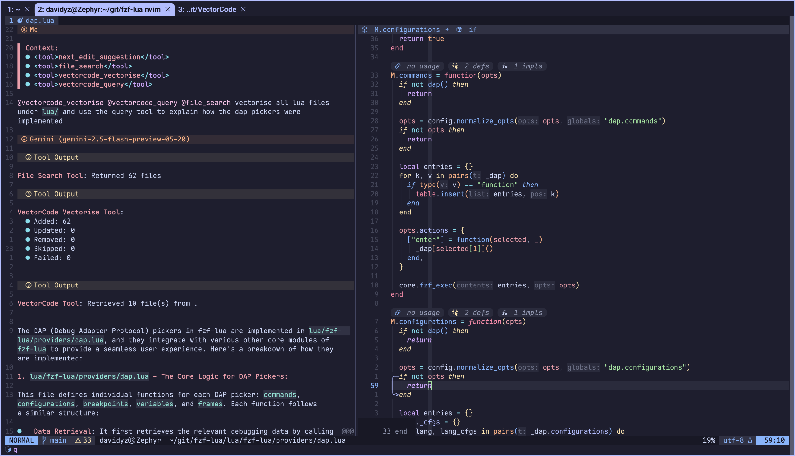

# VectorCode

VectorCode is a code repository indexing tool. It helps you build better prompt
for your coding LLMs by indexing and providing information about the code
repository you're working on. This repository also contains the corresponding
neovim plugin because that's what I used to write this tool.

> [!NOTE]
> This project is in beta quality and is undergoing rapid iterations.
> I know there are plenty of rooms for improvements, and any help is welcomed.

> [!NOTE]
> [Chromadb](https://www.trychroma.com/), the vector database backend behind
> this project, supports multiple embedding engines. I developed this tool using
> SentenceTransformer, but if you encounter any issues with a different embedding 
> function, please open an issue (or even better, a pull request :D).

<!-- mtoc-start -->

* [Why VectorCode?](#why-vectorcode)
* [Documentation](#documentation)
  * [About Versioning](#about-versioning)
* [TODOs](#todos)
* [Credit](#credit)
* [Star History](#star-history)

<!-- mtoc-end -->

## Why VectorCode?
LLMs usually have very limited understanding about close-source projects, projects
that are not well-known, and cutting edge developments that have not made it into
releases. Their capabilities on these projects are quite limited. With
VectorCode, you can easily (and programmatically) inject task-relevant context
from the project into the prompt. This significantly improves the quality of the
model output and reduce hallucination.

## Documentation

> [!NOTE]
> The documentation on the `main` branch reflects the code on the latest commit
> (apologies if I forget to update the docs, but this will be what I aim for). To
> check for the documentation for the version you're using, you can [check out
> the corresponding tags](https://github.com/Davidyz/VectorCode/tags).

- For the setup and usage of the command-line tool, see [the CLI documentation](./docs/cli.md);
- For neovim users, after you've gone through the CLI documentation, please refer to 
  [the neovim plugin documentation](./docs/neovim.md) for further instructions.
- Additional resources:
  - the [wiki](https://github.com/Davidyz/VectorCode/wiki) for extra tricks and
    tips that will help you get the most out of VectorCode;
  - the [discussions](https://github.com/Davidyz/VectorCode/discussions) where
    you can ask general questions and share your cool usages about VectorCode.

If you're trying to contribute to this project, take a look at [the contribution
guide](./docs/CONTRIBUTING.md), which contains information about some basic
guidelines that you should follow and tips that you may find helpful.

### About Versioning

This project follows an adapted semantic versioning:

- Until 1.0.0 is released, the _major version number_ stays 0 which indicates that
  this project is still in early stage, and features/interfaces may change from 
  time to time;
- The _minor version number_ indicates __breaking changes__. When I decide to remove a
  feature/config option, the actual removal will happen when I bump the minor
  version number. Therefore, if you want to avoid breaking a working setup, you
  may choose to use a version constraint like `"vectorcode<0.7.0"`;
- The _patch version number_ indicates __non-breaking changes__. This can include new
  features and bug fixes. When I decide to deprecate things, I will make a new
  release with bumped patch version. Until the minor version number is bumped,
  the deprecated feature will still work but you'll see a warning. It's
  recommended to update your setup to adapt the new features.

## TODOs
- [x] query by ~file path~ excluded paths;
- [x] chunking support;
  - [x] add metadata for files;
  - [x] chunk-size configuration;
  - [x] smarter chunking (semantics/syntax based), implemented with
    [py-tree-sitter](https://github.com/tree-sitter/py-tree-sitter) and
    [tree-sitter-language-pack](https://github.com/Goldziher/tree-sitter-language-pack);
  - [x] configurable document selection from query results.
- [x] ~NeoVim Lua API with cache to skip the retrieval when a project has not
  been indexed~ Returns empty array instead;
- [x] job pool for async caching;
- [x] [persistent-client](https://docs.trychroma.com/docs/run-chroma/persistent-client);
- [-] proper [remote Chromadb](https://docs.trychroma.com/production/administration/auth) support (with authentication, etc.);
- [x] respect `.gitignore`;
- [x] implement some sort of project-root anchors (such as `.git` or a custom
  `.vectorcode.json`) that enhances automatic project-root detection.
  **Implemented project-level `.vectorcode/` and `.git` as root anchor**
- [ ] ability to view and delete files in a collection (atm you can only `drop`
  and `vectorise` again);
- [x] joint search (kinda, using codecompanion.nvim/MCP);
- [-] Nix support (#144);
- [-] Query rewriting (#124).

## Credit

- Thank [@milanglacier](https://github.com/milanglacier) (and [minuet-ai.nvim](https://github.com/milanglacier/minuet-ai.nvim)) for the support when this project was still in early stage;
- Thank [@olimorris](https://github.com/olimorris) for the help (personally and
  from [codecompanion.nvim](https://github.com/olimorris/codecompanion.nvim))
  when this project made initial attempts at tool-calling;
- Thank [@ravitemer](https://github.com/ravitemer) for the help to interface
  VectorCode with [MCP](https://modelcontextprotocol.io/introduction).

## Star History

